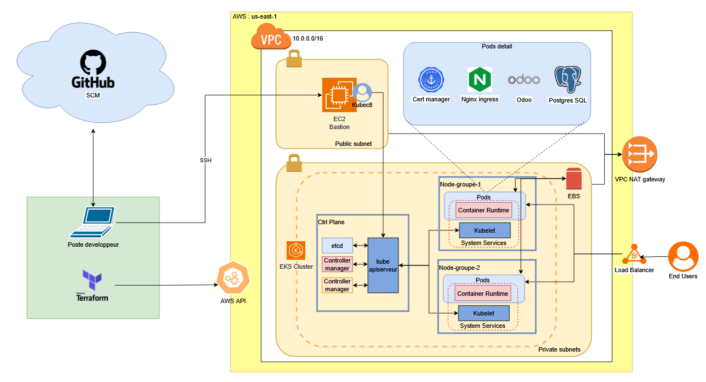
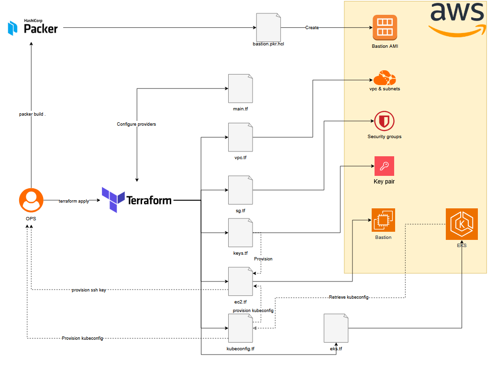
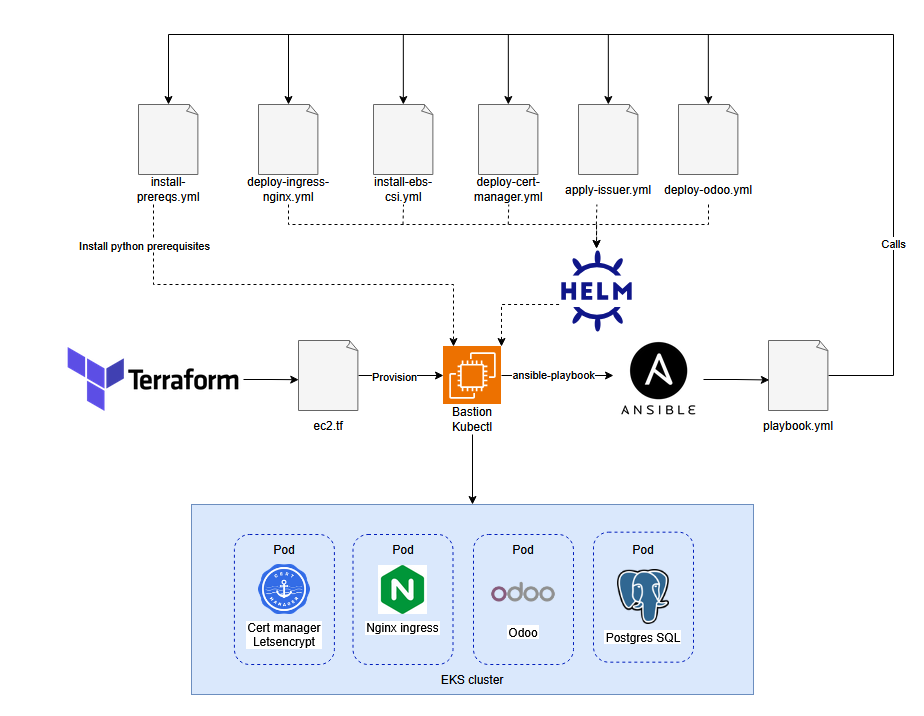

# MSPR2 - Déploiement sur AWS

Ce projet a pour objectif de déployer une infrastructure complète sur AWS, en automatisant chaque étape du processus.

## Infrastructure AWS

- **Création d'une AMI personnalisée** avec Packer.
- **Déploiement du réseau** :
    - VPC dédié
    - Subnets publics et privés
    - Security Groups adaptés
- **Provisionnement d'une instance EC2 (bastion)** pour l'accès sécurisé.
- **Déploiement d'un cluster EKS** (Kubernetes managé) avec Terraform.

## Déploiement applicatif

- **Ingress NGINX** pour la gestion du trafic entrant.
- **Autorité de certification** pour la gestion des certificats SSL.
- **Déploiement d'Odoo** via Ansible et Helm pour l'automatisation et la gestion des releases.

L'ensemble du projet s'appuie sur des outils d'infrastructure as code (Terraform, Packer, Ansible, Helm) pour garantir la reproductibilité et la maintenabilité des déploiements.

## Schéma d'architecture

## Workflow terraform

## Workflow Ansible

## Auteurs

BINET Lucie, DELECROIX Léo, FAROUX–BRASSART Solenn, TAHON Nicolas
EPSI Lille EISI I2
